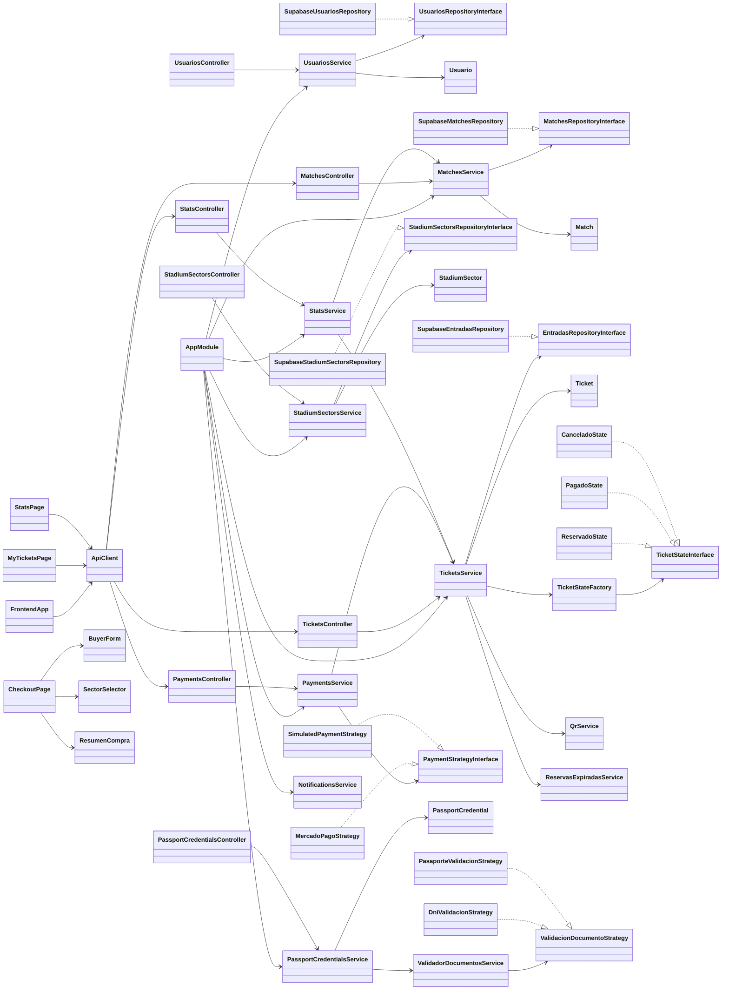

# TicketAR

[](https://app.codacy.com?utm_source=gh&utm_medium=referral&utm_content=&utm_campaign=Badge_grade)


<p align="center">
  <a href="https://nestjs.com" target="_blank" rel="noreferrer"></a>
  <a href="https://nextjs.org" target="_blank" rel="noreferrer"></a>
  <a href="https://react.dev" target="_blank" rel="noreferrer"></a>
  <a href="https://www.typescriptlang.org" target="_blank" rel="noreferrer"></a>
  <a href="https://tailwindcss.com" target="_blank" rel="noreferrer"></a>
  <a href="https://supabase.com" target="_blank" rel="noreferrer"></a>
  <a href="https://clerk.com" target="_blank" rel="noreferrer"></a>
  <a href="https://www.mercadopago.com" target="_blank" rel="noreferrer"></a>
  <a href="https://playwright.dev" target="_blank" rel="noreferrer"></a>
  <a href="https://jestjs.io" target="_blank" rel="noreferrer"></a>
  <a href="https://eslint.org" target="_blank" rel="noreferrer"></a>
  <a href="https://prettier.io" target="_blank" rel="noreferrer"></a>
  <a href="https://pnpm.io" target="_blank" rel="noreferrer"></a>
  <a href="https://nodejs.org" target="_blank" rel="noreferrer"></a>
</p>

Plataforma web para gestion y compra de entradas del Mundial 2026.

---

## Comienza aqui

Si es tu primera vez en el proyecto:

- Revisa la documentacion funcional en [`docs/`](docs/)
- Configura variables de entorno usando [`.env.example`](.env.example)
- Levanta backend y frontend con los comandos de la seccion **Ejecucion local**

---

## Descripcion

TicketAR centraliza el flujo completo de venta de entradas:

- Visualizacion de partidos y sectores del estadio
- Reserva temporal de tickets con expiracion automatica
- Checkout con integracion de pagos
- Emision de QR unico por entrada
- Gestion de perfil e identidad de usuario (DNI/Pasaporte)
- Panel de estadisticas y operaciones administrativas

---

## Arquitectura del proyecto

Este repositorio esta dividido en dos aplicaciones principales:

```text
.
├── backend-nest/      # API REST y logica de negocio (NestJS)
├── frontend-client/   # Aplicacion web (Next.js)
└── docs/              # Documentacion funcional y tecnica
```

### Backend (`backend-nest`)

API en NestJS orientada a modulos:

- `usuarios`: gestion de usuarios y validacion de identidad
- `matches`: partidos y disponibilidad
- `stadium-sectors`: sectores y capacidad
- `tickets`: reserva, estados, expiracion y QR
- `payments`: estrategias de pago (Mercado Pago y simulada)
- `stats`: metricas para panel administrativo
- `notifications`: notificaciones post-pago

### Frontend (`frontend-client`)

Aplicacion Next.js (App Router) con:

- Flujo de compra paso a paso
- Vistas de partidos, checkout y mis tickets
- Integracion de autenticacion con Clerk
- Pruebas E2E y de componentes con Playwright

---

## Diagrama UML de clases (alto nivel)



---

## Patrones de diseno aplicados

- `State Pattern`: ciclo de vida del ticket (`reservado`, `pagado`, `cancelado`)
- `Strategy Pattern`: comportamiento intercambiable para pagos y validaciones
- `Repository Pattern`: abstraccion de acceso a datos (Supabase)
- `Factory Pattern`: creacion de estados de ticket
- `Observer/Event-driven`: eventos desacoplados entre modulos

---

## Stack tecnologico

- **Backend:** NestJS, TypeScript, Supabase, Mercado Pago
- **Frontend:** Next.js, React, Tailwind CSS, TypeScript, Clerk
- **Testing:** Jest, Playwright
- **Tooling:** ESLint, Prettier, pnpm

---

## Requisitos

- Node.js 20+
- pnpm 9+

Instalacion global de pnpm (si no lo tenes):

```bash
npm install -g pnpm
```

---

## Variables de entorno

Usa [`.env.example`](.env.example) como base.

### Backend (`backend-nest/.env`)

```env
SUPABASE_URL=tu_url_de_supabase
SUPABASE_KEY=tu_anon_key_de_supabase
FRONTEND_URL=http://localhost:3001
PORT=3000
```

### Frontend (`frontend-client/.env.local`)

```env
NEXT_PUBLIC_CLERK_PUBLISHABLE_KEY=pk_test_...
CLERK_SECRET_KEY=sk_test_...
NEXT_PUBLIC_CLERK_SIGN_IN_URL=/sign-in
NEXT_PUBLIC_CLERK_SIGN_UP_URL=/sign-up
NEXT_PUBLIC_API_URL=http://localhost:3000
```

---

## Ejecucion local

### 1. Backend

```bash
cd backend-nest
pnpm install
pnpm run start:dev
```

Backend disponible en `http://localhost:3000`.

### 2. Frontend

```bash
cd frontend-client
pnpm install
pnpm run dev
```

Frontend disponible en `http://localhost:3001`.

---

## Comandos disponibles

### Backend (`backend-nest`)

```bash
pnpm run start:dev      # desarrollo con watch
pnpm run build          # build de produccion
pnpm run test           # tests unitarios
pnpm run test:e2e       # tests e2e (jest)
pnpm run test:playwright # suite Playwright
pnpm run lint           # lint
```

### Frontend (`frontend-client`)

```bash
pnpm run dev            # desarrollo
pnpm run build          # build de produccion
pnpm run test           # e2e Playwright
pnpm run test:ct        # component testing Playwright
pnpm run lint           # lint
pnpm run type-check     # chequeo de tipos
```

---

## Testing y calidad

- Pruebas unitarias y de integracion en backend con Jest
- Pruebas E2E y de componentes en frontend con Playwright
- Validacion de estilo y calidad con ESLint

---

## Documentacion adicional

- [Documentacion tecnica y reportes](docs/)
- [Requerimientos funcionales y no funcionales](frontend-client/docs/REQUERIMIENTOS.md)
- [Documentacion de pagos backend](backend-nest/DOCUMENTACION_PAGOS.md)

---

## Seguridad

Para reporte responsable de vulnerabilidades, ver [SECURITY.md](SECURITY.md).

---

## Estado del proyecto

Proyecto en desarrollo activo.

## Convencion de commits

- `feat:` nueva funcionalidad
- `fix:` correccion de errores
- `docs:` cambios de documentacion
- `refactor:` mejora interna sin cambiar comportamiento
- `chore:` tareas de mantenimiento
